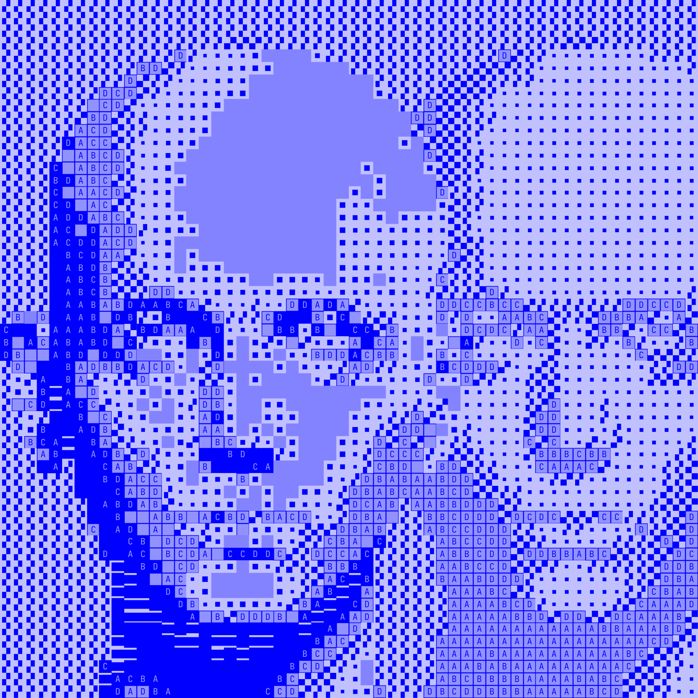

# Tiletone



A Processing sketch that rasterizes images into a grid of tiles, each mapped from pixel brightness.

## Usage

### Prerequisites

- [Processing 4](https://processing.org/download)

### Run

1. Drop your source image into the `data/` folder
2. Update the filename in `Tiletone.pde`:
```java
seed = loadImage("your-image.png");
```
3. Run the sketch in Processing
4. Press `S` to save the output
